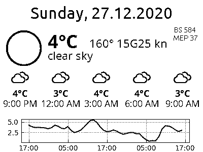

Epaper-Server
=============

This is a companion to the epaper display driver [epaper-esp32](https://github.com/clausgf/epaper-esp32) project. Realized as a FastAPI based web server running in a docker container, it provides images and management for epaper displays.

Images for the epaper displays are automatically updated. They can be freely configured with contents from the web. In addition to weather information which can be displayed in various forms, rendering of information collected from arbitrary web pages is supported. Together with epaper-esp32, this project forms a complete epaper display solution.

Installation
------------
1. Create a `config.yml` file based on the template.
   - You can define multiple displays and aliases.
   - You need a free [OpenWeather API key](https://home.openweathermap.org/users/sign_up) for the `Weather` datasource.
   - Use the `WebScraper` datasource to extract arbitrary information from web sources based on regular expressions. This should be quite flexible.
   - Available widgets include `Date`, `Text` and `WeatherNow`, `WeatherForecast` and `WeatherTemperature`.
2. Review `docker-compse.yml`.
   - Redis-Commander should be activated only for debugging and in isolated, private networks. Deactivate it by commenting out the section.
   - The project works nicely in a private network. For use in public networks, appropriate authentication and encrpytion shall be added.
3. Start the service using `docker-compose up -d`.
   - `docker-compose logs` shows logs
   - `docker-compose down`stops the service
4. It shouldn't be too difficult to add custom widgets. Don't forget to add them to `__init__.py`.

Technical notes
---------------
By default, epaper-server supports these endpoints:
- http://localhost:9830/docs OpenAPI/Swagger docs
- http://localhost:9830/api/displays and links therein: Info about displays
- Optional redis-commander for debugging, http://localhost:9831 (not for production)

Credits
-------
- This project is strongly inspired by https://github.com/ugomeda/esp32-epaper-display by github user ugomeda.
- SVG weather icons are from https://github.com/erikflowers/weather-icons
- PNG conversion from the https://github.com/ugomeda/esp32-epaper-display project
- Further references are found in the source code.
